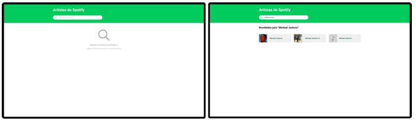

# Artistas spotify - teste dev front-end nível júnior

## Objetivo
### Descrição
Uma página simples com um campo de busca que consulta uma API, essa consulta deve trazer os resultados em uma lista, caso não tenha resultado deve ser exibido uma mensagem que não obteve resultado.

---

### API
A API que deve ser integrada é uma API de GraphQL para buscar artistas do Spotify e está no seguinte endpoint:  
https://spotify-graphql-server.herokuapp.com/graphql  

Query de exemplo:  
```gql
query {
  queryArtists(byName: "Michael Jackson") {
    name
    image
  }
}
```

_Caso GraphQL seja algo completamente novo para você, segue um artigo curto e objetivo sobre o assunto: https://imasters.com.br/back-end/graphql-poder-ao-front-end_

---

### Protótipo
Todo o layout deve seguir o protótipo abaixo (para conseguir inspecionar as informações é necessário criar uma conta no **Figma**):  
https://www.figma.com/file/XISzikTRrDO2Q766Cs552O/Home?node-id=0%3A1



---

### Gerador de projeto
Caso tenha dificuldade de iniciar o projeto segue algumas ferramentas que poderão ajudar, a utilização delas é opicional:  
- React (recomendado): https://reactjs.org/docs/create-a-new-react-app.html
- Vue: https://cli.vuejs.org/guide/creating-a-project.html
- Angular: https://angular.io/tutorial/toh-pt0
- Svelte: https://dev.to/jacobherrington/setting-up-a-svelte-project-in-seconds-with-degit-4dpa

---

## Prazo
Esse teste pode ser executado de uma hora até seis horas de acordo com a experiência do desenvolvedor, o tempo de desenvolvimento não terá tanto peso na avaliação, mas é importante que fique claro a experiência que foi desenvolver esse teste, quais dificuldades, facilidades ou opiniões.

## O que o teste precisa ter
- O projeto precisa ser 100% funcional (caso tenha dificuldade reporte qual seria junto a entrega, ou no decorrer do processo).
- Aplicar os estilos usados no protótipo.
- Ser feito com typescript ou javascript em alguma biblioteca de componentização que você tenha mais facilidade, como: React, Svelte, Vue.js ou Angular.
- Integração com a API GraphQL fornecida, pode ser feito a maneira que achar melhor e mais prática.
- README com documentação mínima para executar o projeto.

## O que será avaliado (júnior)
- Conhecimento mínino da utilização das ferramentas.
- Aplicação dos estilos do protótipo.
- Quaisquer demonstrações extras de qualidades no processo de desenvolvimento (estrutura, decisões, clareza e objetividade).

## Entrega
Preferencialmente um link para o projeto no github, caso não deseje compartilhar, poderá enviar zipado por e-mail para o recrutador, levando em conta que deve ser um projeto git mesmo zipado.
